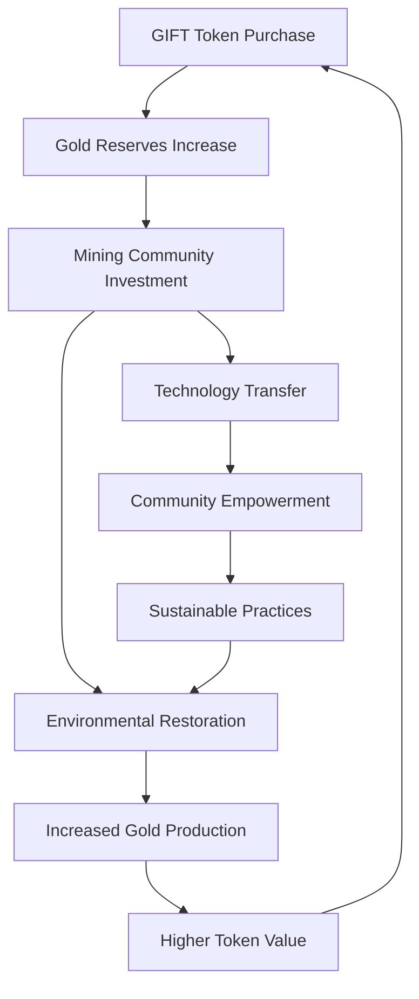

  

    

      

        <svg width="40" height="40" viewBox="0 0 24 24" fill="none" stroke="currentColor" stroke-width="2">
          <circle cx="9" cy="21" r="1"></circle>
          <circle cx="20" cy="21" r="1"></circle>
          <path d="M1 1h4l2.68 13.39a2 2 0 0 0 2 1.61h9.72a2 2 0 0 0 2-1.61L23 6H6"></path>
        </svg>
        <h1 style="font-size: 3.5rem; margin: 0; font-weight: 700; text-shadow: 2px 2px 4px rgba(0,0,0,0.8);">Ubuntu Philosophy</h1>
      

      
I am because we are - Building regenerative wealth together

    

  

*The Opportunity Economy Whitepaper*

---

## The Heart of Ubuntu Tribe: "I Am Because We Are"

Ubuntu Tribe is founded on the ancient African philosophy of Ubuntu - "I am because we are" - which recognizes that individual prosperity is inseparable from collective well-being. This philosophy drives our revolutionary approach to gold tokenization and community empowerment.

### Core Ubuntu Principles

#### **Collective Prosperity**
- Your financial success strengthens the entire community
- GIFT token holders share in mining profits and environmental restoration
- Community-owned gold reserves benefit all participants
- Regenerative mining creates lasting value for future generations

#### **Mutual Empowerment**
- Mining communities gain direct access to global markets
- Technology education and AI-powered financial literacy for all
- Shared governance ensures every voice matters
- Collaborative decision-making on community investments

#### **Shared Responsibility**
- Environmental restoration is everyone's commitment
- Mercury-free mining protects our planet
- Sustainable practices preserve resources for our children
- Collective stewardship of natural assets

## Real-World Asset Innovation

### Gold as the Foundation

Ubuntu Tribe revolutionizes wealth creation by tokenizing physical gold - the world's most trusted store of value. Our GIFT tokens represent real, LBMA-certified gold held in secure vaults, creating unprecedented accessibility to precious metals.

#### **Why Gold?**
- **5,000-year track record** as a store of value
- **Inflation hedge** protecting against currency debasement  
- **Global acceptance** across all cultures and economies
- **Finite supply** ensuring long-term value appreciation
- **Crisis resilience** maintaining value during economic turbulence

#### **Digital Gold Benefits**
- **Instant liquidity** - trade gold 24/7 globally
- **Fractional ownership** - own gold starting from $1
- **No storage costs** - secure vault storage included
- **Global accessibility** - available to anyone with internet
- **Transparent backing** - real-time gold reserves verification

### The Regenerative Model

Our approach goes beyond simple gold backing to create a regenerative economy that benefits everyone:

#### **Environmental Restoration**
- Mercury-free mining techniques protecting ecosystems
- Reforestation programs in mining areas
- Water purification systems for affected communities
- Carbon offset initiatives through sustainable practices

#### **Community Empowerment**
- Direct partnerships with artisanal mining communities
- Fair trade pricing ensuring miners receive just compensation
- Technology transfer and education programs
- Healthcare and education infrastructure development

## AI-Powered Financial Literacy

### Democratizing Financial Education

Ubuntu Tribe integrates advanced AI to provide personalized financial education and investment guidance, ensuring everyone can participate in the gold-backed economy regardless of their background.

#### **Personalized Learning**
- **Custom curricula** based on individual knowledge levels
- **Interactive simulations** for risk-free learning
- **Real-time market insights** with gold price analysis
- **Multi-language support** for global accessibility

#### **Investment Guidance**
- **Portfolio optimization** recommendations
- **Risk assessment** tools for informed decisions
- **Market timing** insights for GIFT token acquisitions
- **Diversification strategies** beyond gold assets

### Community-Driven Knowledge

#### **Peer Learning Networks**
- **Mentorship programs** connecting experienced investors with newcomers
- **Success story sharing** from community members
- **Collaborative investment clubs** for shared learning
- **Local workshops** in mining communities

#### **Transparent Analytics**
- **Real-time gold reserves** verification and reporting
- **Mining community impact** metrics and progress tracking
- **Environmental restoration** progress dashboards
- **Community fund** allocation and results

## The GIFT Token Ecosystem

### Revolutionary 1:1 Gold Backing

Every GIFT token represents exactly 1 gram of LBMA-certified gold, creating the world's most transparent and accessible gold investment vehicle.

#### **Token Features**
- **1:1 Gold Backing**: Each token = 1 gram of physical gold
- **Multi-chain deployment**: Ethereum, Polygon, Binance Smart Chain
- **Instant redemption**: Convert tokens to physical gold anytime
- **Transparent reserves**: Real-time verification of gold holdings

#### **Staking Rewards (8-15% APY)**
- **Gold appreciation**: Benefit from gold price increases
- **Mining profits**: Share in community mining revenues
- **Environmental credits**: Earn from carbon offset programs
- **AI investment returns**: Participate in algorithmic trading profits

### Circular Economy Model

#### **Value Creation Cycle**
- **Token purchases** fund gold acquisition and community development
- **Mining partnerships** generate sustainable gold supply
- **Environmental restoration** creates carbon credits and ecosystem value
- **Community empowerment** ensures long-term sustainability
- **Profits reinvestment** compounds growth for all stakeholders

## Ubuntu DAO Governance

### Community-Driven Decision Making

The Ubuntu DAO ensures that all stakeholders - from GIFT token holders to mining communities - have a voice in shaping our regenerative economy.

#### **Governance Structure**
- **Token-weighted voting** for major platform decisions
- **Community representatives** from each mining partnership
- **Environmental council** overseeing restoration projects
- **Technical committee** managing platform development

#### **Decision Categories**

**Strategic Decisions** (Supermajority Required)
- New mining community partnerships
- Gold reserve allocation strategies
- Environmental restoration priorities
- Major platform upgrades

**Operational Decisions** (Simple Majority)
- Staking reward adjustments
- Community fund distributions
- Educational program expansions
- Technology integration approvals

**Emergency Decisions** (Council Authority)
- Security incident responses
- Market volatility protections
- Regulatory compliance updates
- Critical system maintenance

### Transparent Governance Process

1. **Community Proposal**: Any stakeholder can submit governance proposals
2. **Impact Assessment**: Technical and environmental review of implications
3. **Community Discussion**: Open forum for debate and refinement
4. **Formal Voting**: Weighted voting based on stake and community representation
5. **Implementation**: Automatic execution through smart contracts
6. **Progress Monitoring**: Regular reporting on decision outcomes

## Building the Future Together

### The Ubuntu Advantage

Ubuntu Tribe's philosophy creates a unique competitive advantage in the gold tokenization space:

#### **Sustainable Growth**
- **Community ownership** ensures long-term commitment
- **Environmental restoration** creates additional value streams
- **Fair trade practices** build lasting partnerships
- **Technology transfer** empowers local communities

#### **Risk Mitigation**
- **Diversified gold supply** across multiple mining communities
- **Environmental compliance** reduces regulatory risks
- **Community partnerships** provide supply chain security
- **Transparent operations** build trust with regulators and investors

#### **Innovation Catalyst**
- **AI-powered insights** optimize mining and investment strategies
- **Community feedback** drives product development
- **Open collaboration** accelerates technological advancement
- **Shared knowledge** benefits the entire ecosystem

### Your Role in the Ubuntu Economy

Every participant in Ubuntu Tribe contributes to our collective success:

#### **As a GIFT Token Holder**
- **Earn rewards** from gold appreciation and mining profits
- **Participate in governance** decisions affecting the ecosystem
- **Support communities** through your investment choices
- **Access education** to maximize your financial potential

#### **As a Community Member**
- **Share knowledge** to help others succeed
- **Provide feedback** to improve our platform
- **Advocate for sustainability** in all our operations
- **Build connections** across our global network

#### **As a Mining Partner**
- **Receive fair compensation** for your gold production
- **Access technology** to improve efficiency and safety
- **Participate in governance** representing your community
- **Benefit from restoration** programs in your region

---

## Ready to Join the Movement?

Ubuntu Tribe represents more than just gold tokenization - we're building a new economic model that proves prosperity and sustainability can go hand in hand.

**Start your journey today:**

- **[Get Started](/quick-start)** - Begin with GIFT tokens in 3 simple steps
- **[Read the Whitepaper](/whitepaper/executive-summary)** - Understand our complete vision
- **[Join the Community](/community/contributing)** - Connect with like-minded changemakers

*"I am because we are" - Together, we're creating the opportunity economy.*