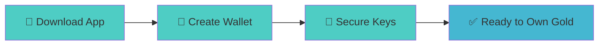
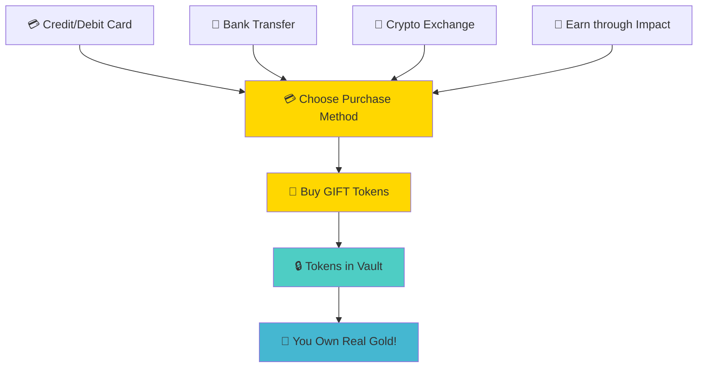
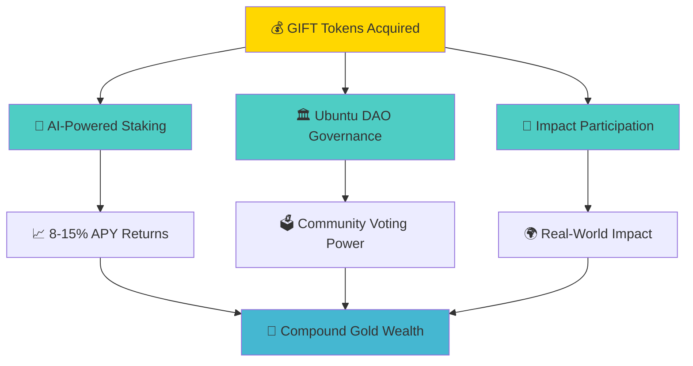
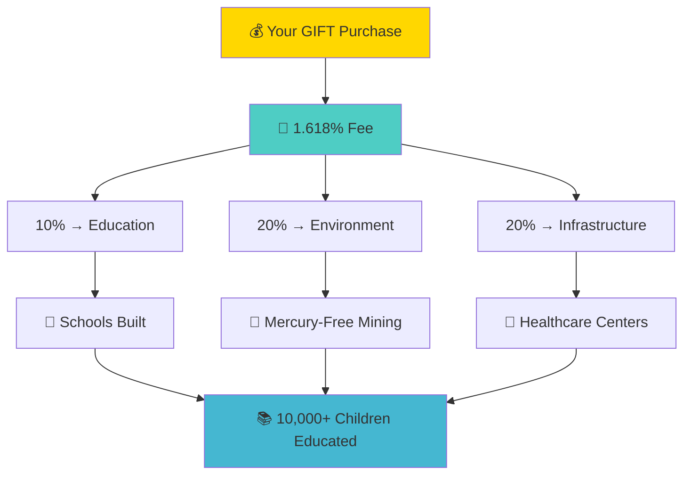

  

    

      

        <svg width="40" height="40" viewBox="0 0 24 24" fill="none" stroke="currentColor" stroke-width="2">
          <polygon points="13,2 3,14 12,14 11,22 21,10 12,10 13,2"></polygon>
        </svg>
        <h1 style="font-size: 3.5rem; margin: 0; font-weight: 700; text-shadow: 2px 2px 4px rgba(0,0,0,0.8);">Quick Start</h1>
      

      
Get started with gold tokens

    

  

## Welcome to Digital Gold Ownership

Join the world's first gold tokenization platform where every GIFT token represents 1 gram of real, LBMA-certified gold. Transform your financial future with instant access to physical gold ownership through blockchain technology.

---

## Quick Links

  

    <svg width="32" height="32" viewBox="0 0 24 24" fill="none" stroke="currentColor" stroke-width="2">
      <circle cx="12" cy="12" r="10"></circle>
      <path d="M8 12l2 2 4-4"></path>
    </svg>
  

  <h3>Executive Summary</h3>
  
Complete overview of the GIFT token ecosystem

  

    <svg width="32" height="32" viewBox="0 0 24 24" fill="none" stroke="currentColor" stroke-width="2">
      <line x1="12" y1="1" x2="12" y2="23"></line>
      <path d="M17 5H9.5a3.5 3.5 0 0 0 0 7h5a3.5 3.5 0 0 1 0 7H6"></path>
    </svg>
  

  <h3>GIFT Economics</h3>
  
How our gold-backed token creates sustainable wealth

  

    <svg width="32" height="32" viewBox="0 0 24 24" fill="none" stroke="currentColor" stroke-width="2">
      <path d="m21.73 18-8-14a2 2 0 0 0-3.48 0l-8 14A2 2 0 0 0 4 21h16a2 2 0 0 0 1.73-3Z"></path>
      <path d="M12 9v4"></path>
      <path d="m12 17 .01 0"></path>
    </svg>
  

  <h3>Why This Matters</h3>
  
The financial crisis we're solving

  

    <svg width="32" height="32" viewBox="0 0 24 24" fill="none" stroke="currentColor" stroke-width="2">
      <path d="M12 2l3.09 6.26L22 9.27l-5 4.87 1.18 6.88L12 17.77l-6.18 3.25L7 14.14 2 9.27l6.91-1.01L12 2z"></path>
    </svg>
  

  <h3>Our Solution</h3>
  
Regenerative gold economy creating real-world impact

  

    <svg width="32" height="32" viewBox="0 0 24 24" fill="none" stroke="currentColor" stroke-width="2">
      <path d="M17 21v-2a4 4 0 0 0-4-4H5a4 4 0 0 0-4 4v2"></path>
      <circle cx="9" cy="7" r="4"></circle>
      <path d="M23 21v-2a4 4 0 0 0-3-3.87"></path>
      <path d="M16 3.13a4 4 0 0 1 0 7.75"></path>
    </svg>
  

  <h3>Ubuntu DAO</h3>
  
Community-driven governance empowering mining communities

  

    <svg width="32" height="32" viewBox="0 0 24 24" fill="none" stroke="currentColor" stroke-width="2">
      <polygon points="3 11 22 2 13 21 11 13 3 11"></polygon>
    </svg>
  

  <h3>Journey Ahead</h3>
  
From $500M gold supply to global regenerative impact

---

## **3 Steps to Own Real Gold**

### **Step 1: Secure Your Digital Vault**

**Mobile-First Gold Ownership:**
- 📱 **Download Ubuntu Tribe App** (iOS/Android coming Q2 2024)
- 🔐 **Create Secure Wallet** with biometric protection
- 🔑 **Backup Recovery Phrase** - Your keys to real gold ownership
- 🌍 **Multi-Chain Support**: Ethereum, Polygon, Binance Smart Chain

**Why Mobile Matters:**
- 🌍 **1.4B unbanked** people primarily use smartphones
- 📱 **Instant access** to gold markets 24/7
- 🔒 **Bank-grade security** with Fireblocks integration

### **Step 2: Acquire Your First GIFT Tokens**

**Multiple Ways to Own Gold:**
- 💳 **Fiat Gateway**: Buy directly with credit card or bank transfer
- 🔄 **Crypto Exchange**: Trade your existing crypto for GIFT tokens
- 🎁 **Earn Rewards**: Participate in community impact programs
- 🤝 **Vaultoro Integration**: Access $300M OTC trading infrastructure

**What You Get:**
- 🥇 **1 GIFT = 1 gram** LBMA-certified gold (99.99% purity)
- 🏛️ **Secure Storage**: Brinks & Loomis professional vaults
- 🔗 **Chainlink Verification**: Real-time on-chain proof of reserves
- 📱 **Instant Liquidity**: Trade 24/7 via mobile app

### **Step 3: Maximize Your Gold Returns**

**🤖 AI-Powered Gold Staking:**
- 📈 **Target 8-15% APY** through intelligent DeFi strategies
- 🔄 **Automated Optimization**: AI manages your gold for maximum returns
- 💰 **Compound Growth**: Reinvest rewards to accelerate wealth building
- 🛡️ **Risk Management**: Smart contracts protect your principal

**🏛️ Ubuntu DAO Participation:**
- 🗳️ **Vote on Impact**: Decide how community funds help mining regions
- 👩‍💼 **Support Women Leaders**: 60% of our executives are women
- 🌿 **Environmental Choices**: Direct mercury-free mining initiatives
- 🏥 **Community Development**: Fund healthcare and education projects

**🌱 Regenerative Impact Rewards:**
- 🎁 **Bonus GIFT Tokens**: Earn extra rewards for impact participation  
- 🏆 **Recognition System**: Build reputation through meaningful contributions
- 🌍 **Global Network**: Connect with changemakers worldwide
- 📊 **Impact Tracking**: See real results from your participation

---

## 🌟 **Your Gold-Backed Future Starts Now**

### 📈 **Wealth Building Strategies**

**🎯 Conservative Approach:**
- 💰 **Buy & Hold GIFT**: Benefit from gold appreciation + staking rewards
- 🔒 **Long-term Security**: Hedge against inflation and currency devaluation  
- 📊 **Steady Growth**: Target 8-15% annual returns through AI optimization

**🚀 Active Participation:**
- 🗳️ **DAO Governance**: Influence how $500M+ gold supply creates impact
- 🌱 **Impact Rewards**: Earn bonus tokens for community participation
- 🏆 **Leadership Roles**: Guide mining community development initiatives

**💎 Advanced Strategies:**
- 🔄 **DeFi Integration**: Use GIFT as collateral across multiple protocols
- 🌍 **Cross-Chain Arbitrage**: Maximize returns across Ethereum, Polygon, BSC
- 🤝 **Community Building**: Create local Ubuntu Tribe chapters worldwide

### 🌍 **Real-World Impact You're Creating**

Every GIFT token you own directly funds positive change:

**📊 Impact Metrics (Live Dashboard):**
- 🏫 **Education**: 15 schools built, 10,000+ children served
- 🌿 **Environment**: 50 tons mercury prevented from entering ecosystems
- 🏥 **Healthcare**: 8 clinics operational, 25,000+ patients treated annually
- 👩 **Women Empowerment**: 5,000+ women miners with fair access to markets

---

## 🛡️ **Security & Best Practices**

### 🔐 **Protect Your Gold**
- 🔑 **Never Share Keys**: Your private keys = your gold ownership
- ✅ **Verify Transactions**: Always double-check before confirming
- 📱 **Use Official Apps**: Only download from verified app stores
- 🔒 **Enable 2FA**: Add extra security layers to your accounts

### 📊 **Smart Investment Tips**
- 💰 **Start Small**: Begin with $100-500 to understand the system
- 📈 **Dollar-Cost Average**: Regular purchases reduce volatility impact
- 🔄 **Reinvest Rewards**: Compound your staking returns for maximum growth
- 🌍 **Stay Informed**: Follow Ubuntu DAO governance discussions

---

## 🚀 **Ready to Transform Your Financial Future?**

### 📞 **Get Support & Connect**

**🌍 Global Community:**
- 💬 **Telegram**: Join 50,000+ GIFT holders worldwide
- 🐦 **Twitter**: Follow @UbuntuTribe for daily updates
- 📺 **YouTube**: Watch educational content and impact stories
- 📧 **Email**: support@utribe.on for personalized assistance

**📚 Essential Resources:**
- 📊 **[Complete Whitepaper](/whitepaper/executive-summary)**: Deep dive into GIFT economics
- 🏛️ **[Ubuntu DAO](/whitepaper/governance-model)**: Understand community governance
- 🔐 **[Security Guide](/community/support)**: Protect your gold investments
- ❓ **[FAQ](/community/faq)**: Answers to common questions

### 🎯 **Your Next Steps**

**⚡ Immediate (Next 24 Hours):**
1. 📱 **Download the app** and create your secure wallet
2. 💰 **Buy your first GIFT tokens** ($100-500 recommended start)
3. 🤖 **Enable AI staking** to start earning 8-15% APY
4. 🗳️ **Cast your first vote** in Ubuntu DAO governance

**🚀 Short-term (Next 30 Days):**
1. 📈 **Set up recurring purchases** to dollar-cost average
2. 🌱 **Join impact initiatives** to earn bonus rewards
3. 🏆 **Build reputation** through community participation
4. 📊 **Track your impact** via the live dashboard

**💎 Long-term Vision:**
1. 🌍 **Become a regional ambassador** for the Opportunity Economy
2. 🏛️ **Lead governance proposals** for mining community development
3. 💰 **Build generational wealth** through compound gold returns
4. 🌟 **Help onboard the next million** unbanked individuals

---

## 🌟 **Welcome to the Opportunity Economy!**

You're not just buying gold – you're joining a movement that's transforming how 1.4 billion unbanked people access wealth, while healing mining communities and restoring our planet's ecosystems.

Every GIFT token you own represents:
- 💰 **Real gold** in your digital vault
- 🌱 **Environmental restoration** in mining regions  
- 🏫 **Education** for thousands of children
- 👩 **Economic empowerment** for women miners
- 🔮 **A sustainable future** for generations to come

**The Ubuntu philosophy says "I am because we are."** Your financial success creates prosperity for entire communities. Your gold ownership funds mercury-free mining. Your participation builds a regenerative economy that works for everyone.

**Ready to own real gold and change the world?** 

🚀 **[Start Your Journey Now →](https://app.utribe.on)**

---

*Questions? Join our [Global Community](/community/support) or read our comprehensive [FAQ](/community/faq) for detailed answers.*