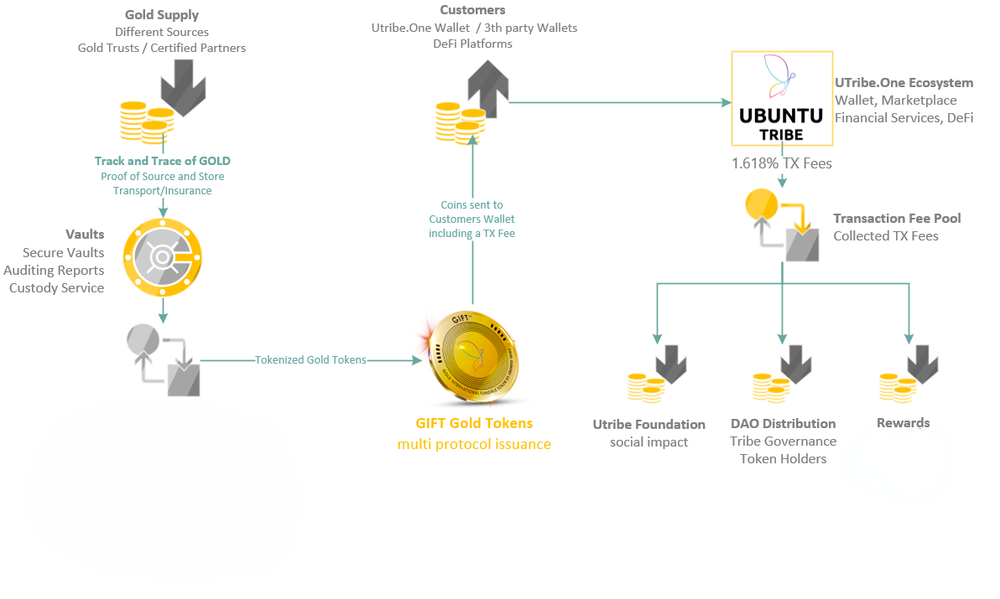
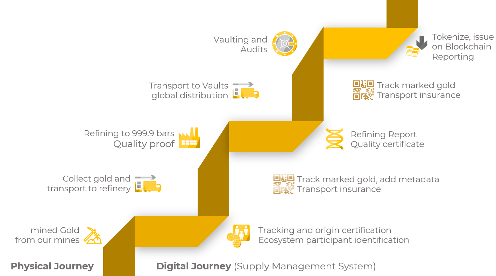
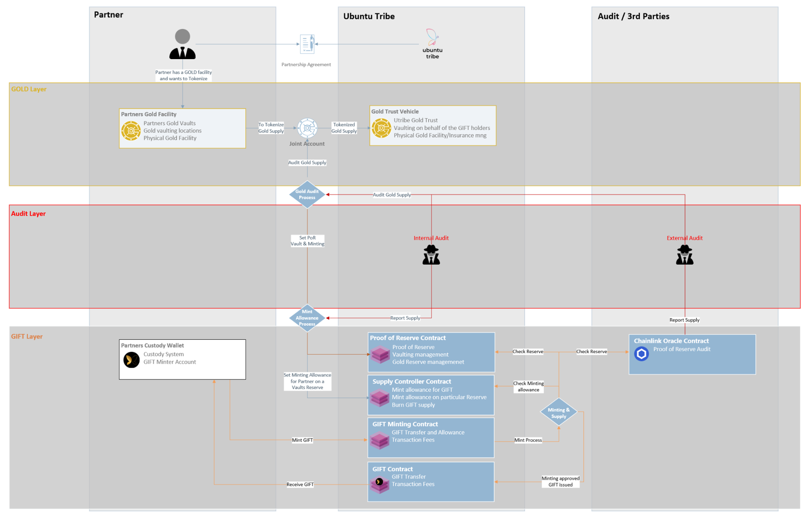

# How GIFT works 🔗

GIFT is an ERC-20 upgradable Contract managed by our Fireblocks MPC (multi-party computation) wallet account. The Token is available on Polygon (cross-chain coming Late 2025).

## The Digital Gold Journey

An overview of the GIFT Ecosystem and tokenization process.

## The Physical Gold Journey

# GIFT Treasury and Issuance

## Issuance / Minting of GIFT

GIFT Tokens are authorized for issuance by the company once gold verification is confirmed through an audit report.

Our exclusive track and trace technology governs the sourcing and vaulting of the gold. The complete workflow, alongside relevant reports, is accessible for public scrutiny and verification. External auditors ensure data accuracy through ongoing audits. This enables real-time publication of the physically vaulted gold supply to the proof of reserve on the Chainlink protocol.

For details see [GIFT Proof of Reserve and Minting allowance](./Smart_contracts/Proof_of_reserve_contract.md)

> ⚠️ The issuance/Minting of GIFT is protected by Utribe PoR contract and Chainlink's Proof of Reserve max supply Oracle

GIFT tokens are primarily issued on the Polygon Blockchain, due to lower gas fees.

## Physical Gold allocation and Issuance

We maintain a revolving gold facility with our Suppliers, ensuring our physical gold reserves consistently align with the minted GIFT coins, verified through Chainlink's Proof of Reserve. 
Tokens in circulation are intrinsically tied to the vault gold account. The maximum Supply is restricted to the audited Proof of Reserve validated by Chainlink's Proof of Reserve Oracle.

Real-time reporting of the physical Supply is executed by our audit partners and reported directly onto the Chainlink Blockchain. We settle daily Gold purchases, organized into minimum volumes of 1kg of LBMA gold.

## Traceability of GIFT and the physical Gold

In our track and trace software we effectively manage our gold supply and auditing.
During phase 1 our primary Partner serves as our gold supplier, directing gold allocation directly into Vaults in Copenhagen, Stuttgart and Zürich.
This eliminates the need for extra transportation. Our Track & Trace Software orchestrates a well-defined process flow for gold vaulting and subsequent auditing of the gold.

# Gift Purchase

Customers can purchase GIFT through our Wallet or our web3 web-dApp, with the following accepted payments methods:

* Credit Card purchases
* Payments in USDC/USDT (Swapping, suspect KYC proofed whitelisting)
* Payment Options from Partners (credit card, mobile money payments, vouchers, swapping) are constantly been added, we publish new integrations on our website and inside the Utribe Wallet
* 3rd party exchanges announced on our website once listings are confirmed

Once payments are verified through our backend services, the GIFT coins are dispatched to the customer.

This process operates on a dedicated wallet and a Scripting API, seamlessly integrated into Fireblocks. Transaction controls, such as maximum amount protection, are enforceable through policies

## Pricing of GIFT/Gold

GIFT is a store of value with its pricing anchored in two reliable sources: Chainlink Price Oracles and the official GOLD price from the Market. Regular fixed interval comparisons ensure accurate and up to date pricing information.

Main Price Source pegged to the value of gold: https://api.utribe.app/gift/price (updated every 30 seconds).

For our On-chain Price manager, check out our smart contract documentation here : [GIFT Price on-chain](./Smart_contracts/Pricing_Smart_Contract.md)

* USD <> XAUD
* KES, Naira (price comparicion) EUR and others coming soon

## Impact on price

As we are getting listed on exchanges there will be a demand/supply price matching and it could be that the GIFT token on the exchanges has a higher price than on the gold market itself. This we can't control as it is a free market.

Customers are not compelled to sell their tokens below market prices. Selling offers are user-triggered or by the market markers. Alternatively, tokens can be redeemed by physical gold. This gold can either be shipped to the customer or sold through our gold brokers at official spot prices

# On-Ramp Fees

| On-Ramp Service | Fee % |
| --- | --- |
| Credit Card payment | 5% + card fees +1% payment service provider |
| USDC/USDT direct swaps | 0% - 5% +Gas Fees, depends on Swap Pool |
| Mobile Money (Kenya via Swypt) | 5% + Service Provider Fees |
| Vouchers | coming soon |

# KYC and Compliance

KYC will be required depending on the monthly purchase amount/limit on Fiat → GIFT and for GIFT redemption.

## KYC requirements

* Up to $1000: E-Mail verification and profile setup
* $10000 plus: Full KYC including ID document and person verification
* $50,000: Advanced verification, source of funds verification
* Fiat Top-ups to cards and partners require a valid KYC

# Physical Gold redemption

When a customer opts to redeem their Tokens for physical Gold, the customer must register for a redemption process. This procedure entails establishing the details for delivery, transportation, insurance, and token burn agreement.

The Tokens to be redeemed are sent to a distinct redemption account on Fireblocks and are either burnt or reallocated with physical gold. As an added convenience, Utribe will progressively introduce pickup locations for direct redemption to physical gold.

The Shipping to the customer is coordinated by our supplier, through trusted channels, bolstered by insurance coverage.

# Transaction Fees

We charge basic Transaction Fees on circulating GIFT Tokens at a rate of 1.618% per transaction. This fee applies to both Tokens purchases and transactions with reduced fees for larger transactions. Larger transactions will have a discounted lower transaction fee.

| Number of Tokens | Equivalent in Euro ≈ | TX Fee % |
| --- | --- | --- |
| Up to 2000 Tokens | ≈ Euro 100.00 | 1.618% |
| Up to 10k Tokens | ≈ Euro 500.00 | 1.2% |
| Up to 20k Tokens | ≈ Euro 1000.00 | 1% |
| Up to 200k Tokens | ≈ Euro 10'000.00 | 0.7% |
| Up to 1mln Tokens and above | ≈ Euro 50'000.00 | 0.5% |

initial pricing, this can be adjusted by the companies general assemblies and later governed by the Ubuntu Tribe community DAO.

## Use of transaction Fees

The transaction fees are collected automatically by the Smart Contract and managed by the Company.